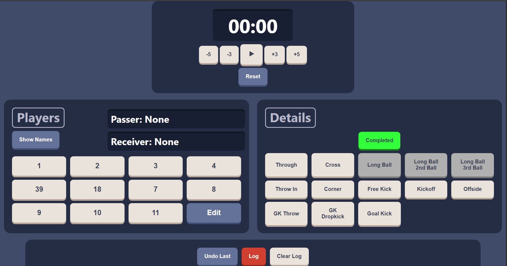
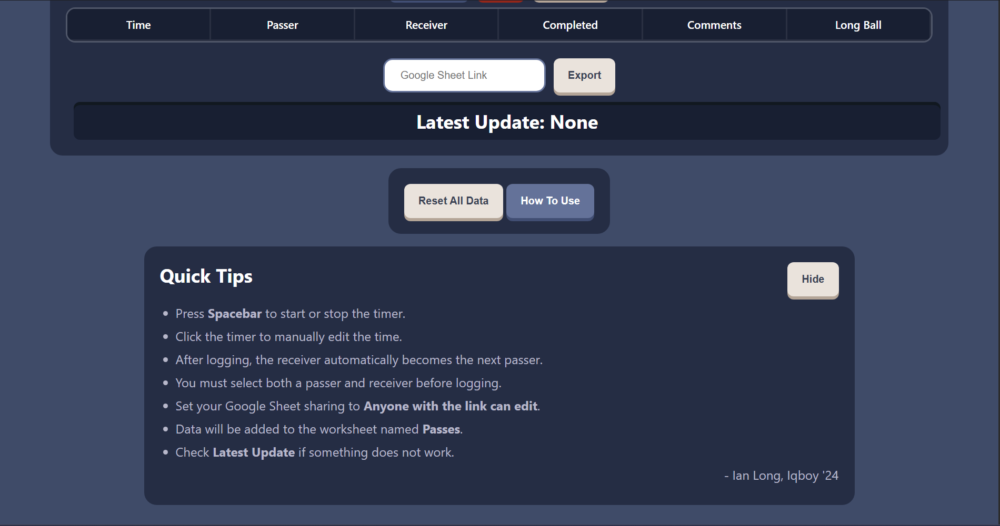
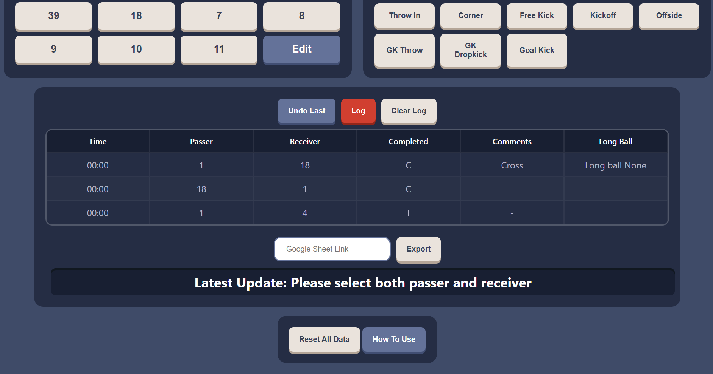
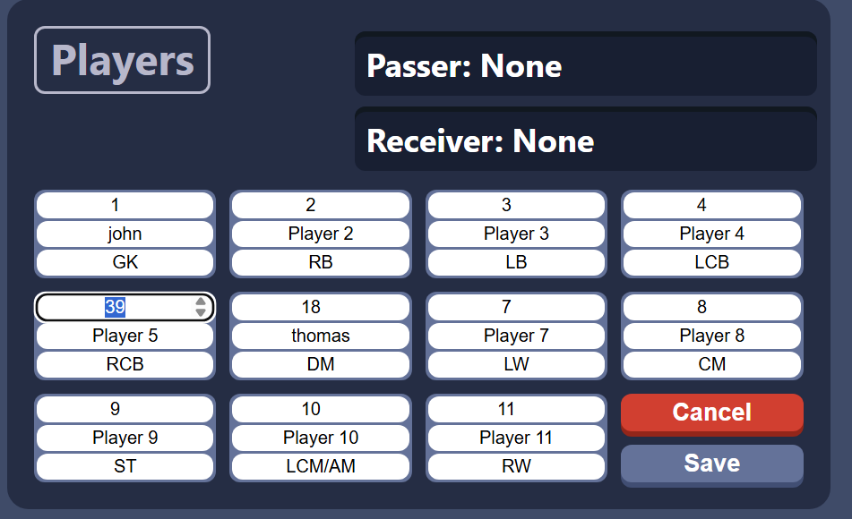
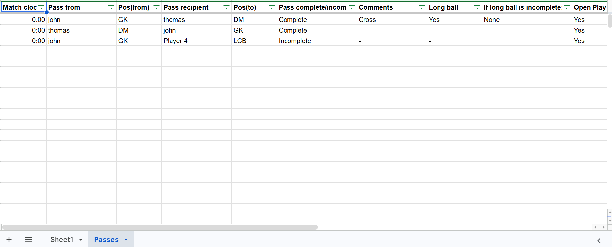

# Football Data Logger

A simple web app to help log football pass data while watching a match

## What it does

- Logs passer, receiver, match time, completion status and additional details
- Automatically sets the receiver as the next passer
- Allows player numbers, names, and positions to be edited
- Stores events locally before export
- Exports logged data to a Google Sheet worksheet named `Passes`

## Tech Stack

- HTML
- CSS
- JavaScript
- Python Flask
- Google Sheets API
- Render deployment

## Why I built this

I built this project for my former coach to help him and his players track their passing data from their matches faster.
This also was to practise vanila JavaScript, specifically, DOM manipulation, state management, event handling, responsive layout, Flask routing, and API integration.

## Key Learning Points

- Managing frontend state without a framework
- Structuring event data for export
- Handling substitutions by saving player snapshots per event instead of referring to a player information list
- Connecting a frontend app to a Flask backend
- Deploying a full-stack app with environment variables

## How to Use

1. Edit player information if applicable
2. Start the timer or press Spacebar
3. Select passer and receiver
4. Add pass details if needed
5. Press Log
6. After logging events, paste a Google Sheet link
7. Export data to the `Passes` worksheet

## Live Demo

[https://iqboy-pass-logger-tool.onrender.com/]

## Screenshots

### Main Interface

### Player Edit Mode

### Google Sheet Output

